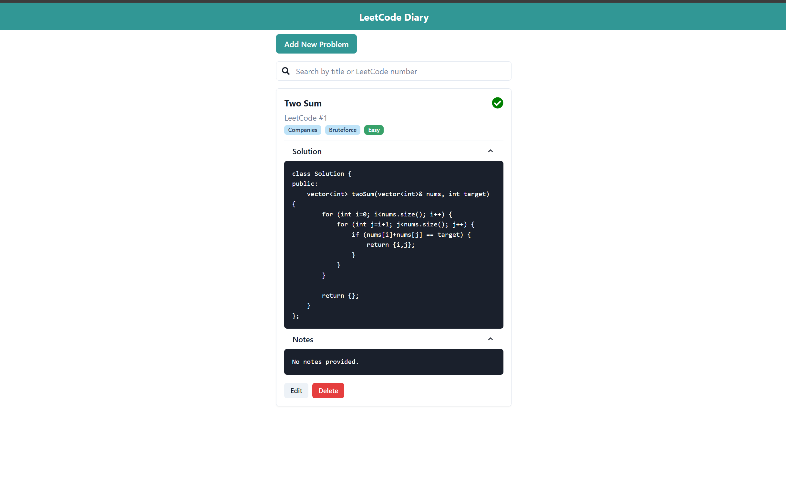
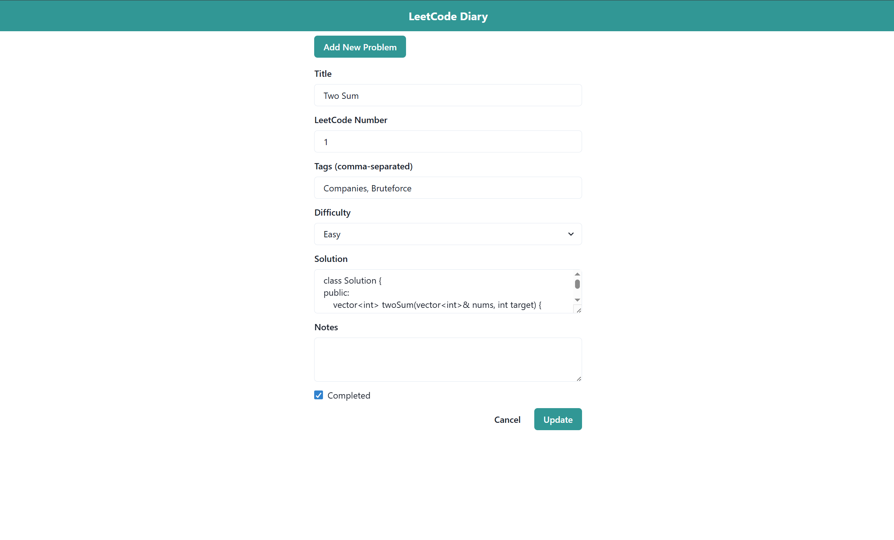

# LeetCode Diary

A personal LeetCode problem tracker and diary built with React and Chakra UI.  
Track your problem-solving progress, organize problems by tags and difficulty, and keep notes and solutions handy — all in one place.





---

## Features

- **Add, edit, and delete problems** with details like title, LeetCode number, tags, difficulty, solutions, and notes.
- **Search functionality** to quickly find problems by title or LeetCode number.
- **Filterable problem list** with tags and difficulty badges.
- **Mark problems as completed** with a clear visual indicator.
- **Expandable sections** for clean and readable solutions and notes, styled like a code editor.
- Responsive and intuitive UI built with [Chakra UI](https://chakra-ui.com/).

---

## Tech Stack

- React
- TypeScript
- Chakra UI
- React Icons
- Fetch API for backend communication

---

## Installation

### Prerequisites

- Node.js (v14 or above recommended)
- npm or yarn

---

### Setup

1. **Clone the repository**

   ```bash
   git clone https://github.com/xsolstice1/lc-diary.git
   cd leetcode-diary

  

