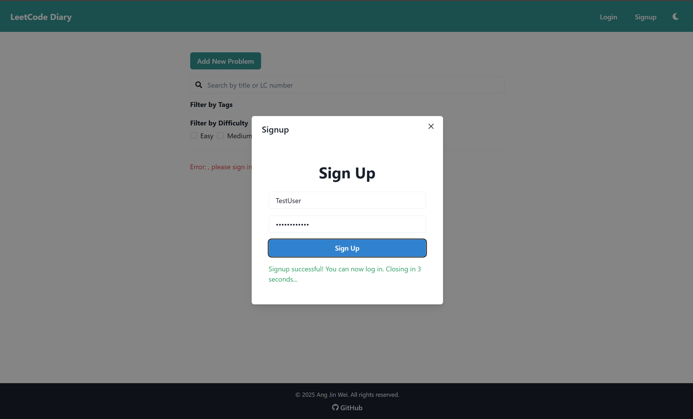
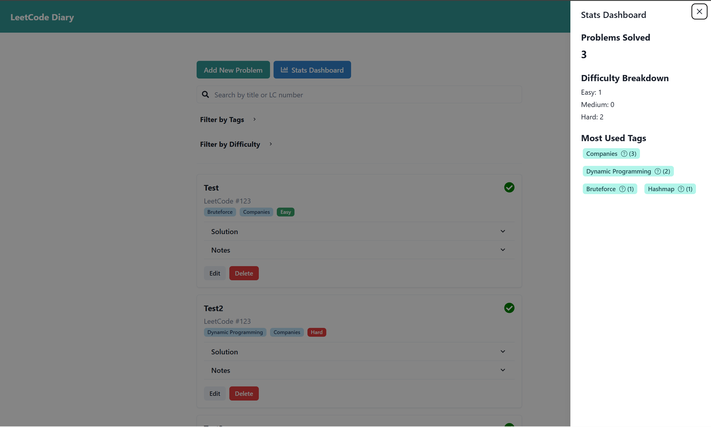

# LeetCode Diary

A personal LeetCode problem tracker and diary built with React and Chakra UI.  
Track your problem-solving progress, organize problems by tags and difficulty, and keep notes and solutions handy — all in one place.






---

## Features

- **Add, edit, and delete problems** with details like title, LeetCode number, tags, difficulty, solutions, and notes.
- **Search functionality** to quickly find problems by title or LeetCode number.
- **Filterable problem list** with tags and difficulty badges.
- **Mark problems as completed** with a clear visual indicator.
- **Expandable sections** for clean and readable solutions and notes, styled like a code editor.
- **Statboard** to view your overall LeetCode journey including completion, count by difficulty and most used tags!
- Responsive and intuitive UI built with [Chakra UI](https://chakra-ui.com/).

---

## Live Demo

Frontend hosted with [Vercel](http://vercel.com/)

Backend hosted with [Render](https://render.com/)

Access the live demo here [https://lc-diary.vercel.app/](https://lc-diary.vercel.app/)

---

## Tech Stack

- React
- TypeScript
- Chakra UI
- React Icons
- Fetch API for backend communication

---

## Directory Structure

```plaintext
lc-diary/
├─ assets/
│  ├─ ss1.png
│  ├─ ss2.png
│  ├─ ss3.png
│  ├─ ss4.png
│  ├─ ss5.png
│  └─ ss6.png
├─ client/
│  ├─ .vercel/
│  │  ├─ project.json
│  │  └─ README.txt
│  ├─ public/
│  │  ├─ favicon.ico
│  │  └─ vite.svg
│  ├─ src/
│  │  ├─ auth/
│  │  │  └─ AuthContext.tsx
│  │  ├─ components/
│  │  │  ├─ Footer.tsx
│  │  │  ├─ Navbar.tsx
│  │  │  ├─ ProblemCard.tsx
│  │  │  └─ ProblemForm.tsx
│  │  ├─ pages/
│  │  │  ├─ index.tsx
│  │  │  ├─ login.tsx
│  │  │  └─ signup.tsx
│  │  ├─ types/
│  │  │  ├─ Problems.ts
│  │  │  └─ Users.ts
│  │  ├─ utils/
│  │  │  └─ ExportToCSV.ts
│  │  ├─ App.tsx
│  │  ├─ index.css
│  │  ├─ main.tsx
│  │  └─ vite-env.d.ts
│  ├─ .gitignore
│  ├─ eslint.config.js
│  ├─ index.html
│  ├─ package-lock.json
│  ├─ package.json
│  ├─ README.md
│  ├─ tsconfig.app.json
│  ├─ tsconfig.json
│  ├─ tsconfig.node.json
│  └─ vite.config.ts
├─ .gitignore
├─ air.toml
├─ go.mod
├─ go.sum
├─ main.go
└─ README.md
```
---

## Installation

### Prerequisites

- Node.js (v14 or above recommended)
- npm or yarn

---

### Setup

1. **Clone the repository**

   ```bash
   git clone https://github.com/xsolstice1/lc-diary.git
   cd leetcode-diary

  

